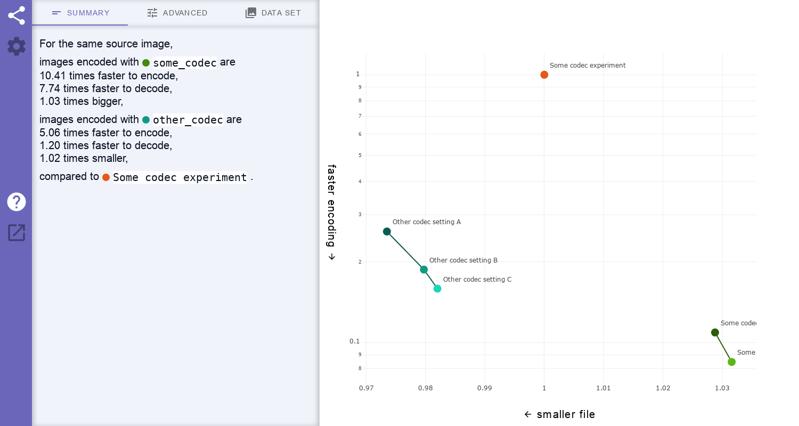

# Codec-Compare

Codec-Compare is a static front-end framework presenting and aggregating
performance data, in order to compare the codecs that were used to generate that
data.

Input data is expected to be in [JSON format](#plug-data-at-serve-time). It is
aggregated based on some fields used as matchers. Stats are computed and plotted
for the fields selected as metrics:



The intent is a tool that is both novice-friendly, so that anyone landing on the
page can understand what is shown, but also useful to experts, by offering a
convenient interactive user interface with matcher, metric and filter settings.
The presented data should be easily reproducible and up-to-date.

In contrast to more traditional
[comparative benchmarks](https://storage.googleapis.com/avif-comparison/index.html),
Codec-Compare aims to aggregate statistics after comparing pairs of two
similarly encoded images, to avoid some of the bias brought by comparing already
aggregated metrics. Most absolute metrics heavily depend on the dimensions and
content of the source image and may not reflect the strengths of a codec when
averaged; relative metrics can bring another perspective, at the expense of a
reduced data point count due to discarded unmatched encoded images.

Feel free to file an issue for any question, suggestion or bug report.
Contributions are also welcome, see [CONTRIBUTING](CONTRIBUTING.md).

## Build and run

Follow these instructions after cloning this repository to build the static
framework.

Install `npm`: https://docs.npmjs.com/downloading-and-installing-node-js-and-npm

From the project root directory, install the project's dependencies:

```sh
npm install
```

### Development

To build and immediately view the framework in a browser:

```sh
npm run dev
```

### Production

To only build:

```sh
npm run build
```

Files are generated in `dist/`. They can be served as is, for example with
`npm run preview` (from root folder) or `python3 -m http.server` (from `dist/`
folder).

## Advanced

### Structure

Codec-Compare has:

  - A main landing page `index.html`.
  - An image viewer `visualizer.html`.
  - [Typescript](https://www.typescriptlang.org)
    [web components](https://developer.mozilla.org/en-US/docs/Web/Web_Components)
    in `src/`.
  - A dependency on [Lit](https://lit.dev).
  - A dependency on [Plotly.js](https://plotly.com/javascript/).
  - A dependency on
    [Material Web Components](https://github.com/material-components/material-web).
  - A dependency on [Material Icons](https://fonts.google.com/icons).
  - Graphical assets and demo placeholders in `assets/`.
  - A `package.json` project configuration file (used by `npm install`).
  - A `tsconfig.json` TypeScript configuration file (used by `npm run dev` and
    `npm run build`).
  - A `vite.config.js` Vite configuration file (used by `npm run dev` and `npm
    run build`).
  - A `karma.conf.js` Karma configuration file (used by `npm run test`).

Note: See
https://lit.dev/docs/components/properties/#avoiding-issues-with-class-fields
for why `useDefineForClassFields` is set to `false` in `tsconfig.json`.

### Plug data at serve time

For each batch of data, format it as the following JSON pattern:

```json
{
  "constant_descriptions": [
    {"codec": "Name of the codec used to generate this data"},
    {"version": "Version of the codec used to generate this data"},
    {"time": "Timestamp of when this data was generated"},
    {"<Any other constant name>": "<Any other constant description>"}
  ],
  "constant_values": [
    "<Name of the codec, such as 'libavif'>",
    "<Version of the codec, such as 'v1.2.3' or git hash 'abc0123'>",
    "<Timestamp, such as '2020-02-02T12:34:56'>",
    "<Any other constant value>"
  ],
  "field_descriptions": [
    {"<Any field name>": "<Any field description>"},
    {"<Another field name>": "<Another field description>"},
    {"<Another field name>": "<Another field description>"}
  ],
  "field_values": [
    ["<Value of first field of first row>", 0, "<Value of third field of first row>"],
    ["<Value of first field of second row>", 0, "<Value of third field of second row>"]
  ]
}
```

This JSON structure mostly uses arrays ("ordered collections of values"
according to json.org) instead of objects ("unordered sets of name/value pairs")
to make sure the description order matches the value order.

See [this demo file](assets/demo_batch_webp_installed.json) for a full example.

Reference each of these batches in a single top-level list with the following
JSON pattern:

```json
[
    ["path/to/some/batch/entries.json"],
    ["path/to/other/batch/entries.json"]
]
```

Serve these alongside the generated web files and point to
`index.html?load=path/to/json_list.json`.

### Generate data

See the wiki for an example bash script that generates data for AVIF, WebP and
JPEG XL to be displayed in Codec-Compare:

https://github.com/webmproject/codec-compare/wiki/Generate-AVIF,-WebP,-JPEG-XL-data-(bash-script)

## License

See the [Apache v2.0 license](LICENSE) file.
